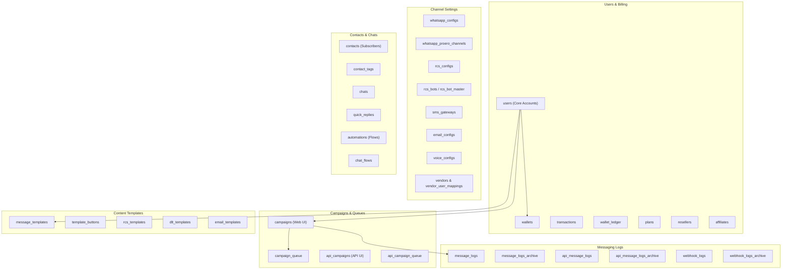

# Database Structure & Relations Documentation 🗄️

This document outlines the entire database structure, table definitions, relationships (both physical foreign keys and application-level logical links), and optimization/normalization opportunities for the **NotifyNow** project.

The application uses **MariaDB / MySQL** as its database engine. Database configurations are loaded from `backend/.env` and queried dynamically using raw SQL queries.

---

## 1. Functional Grouping of Tables
The database consists of **57 tables**, which can be categorized into 8 functional modules:

---

## 2. Comprehensive Table Catalog
Here is the detailed list of tables, grouped by their modules, including primary keys, attributes, and relationships.

### A. User, Partner & Billing Module
These tables manage system access, user roles (`admin`, `reseller`, `user`), subscriptions, pricing, wallet credits, and partners.

| Table Name | Primary Key | Description / Key Attributes | Relationships & Keys |
| :--- | :--- | :--- | :--- |
| **`users`** | `id` (int) | Core tenants table. Stores names, emails, roles, wallet balances, custom pricing per channel, and configurations. | **FK**: `rcs_config_id` ➔ `rcs_configs(id)` **FK**: `whatsapp_config_id` ➔ `whatsapp_configs(id)` **Logical FK**: `plan_id` ➔ `plans(id)` |
| **`wallets`** | `id` (int) | Tracks total, spent, and available credits for each user. | **FK**: `owner_user_id` ➔ `users(id)` (ON DELETE CASCADE) |
| **`transactions`** | `id` (int) | Logs credits purchased, adjustments, and pricing. | **FK**: `user_id` ➔ `users(id)` (ON DELETE CASCADE) |
| **`wallet_ledger`** | `id` (int) | Double-entry ledger audit log (`IN`/`OUT`) detailing balance changes, actors, reasons, and target transaction IDs. | **Logical FK**: `owner_user_id` ➔ `users(id)` |
| **`plans`** | `id` (varchar) | Defined pricing tier options. Holds monthly credits, channel JSON lists, limits, and pricing. | Primary key referenced by `users.plan_id`. |
| **`resellers`** | `id` (int) | Contains domains, white-label configurations, payment gateway details (PayPal, CCAvenue), and revenue stats. | Referenced logically by `users.reseller_id`. |
| **`affiliates`** | `id` (int) | Holds referral code, stats, signups, and commission details. | **Logical FK**: `user_id` ➔ `users(id)` |
| **`otp_verifications`** | `id` (int) | Stores mobile OTP codes, session tokens, and expiration dates. | **FK**: `user_id` ➔ `users(id)` (ON DELETE CASCADE) |

---

### B. Messaging Templates & Content Module
These tables store dynamic templates used to send campaigns.

| Table Name | Primary Key | Description / Key Attributes | Relationships & Keys |
| :--- | :--- | :--- | :--- |
| **`message_templates`** | `id` (varchar) | Core WhatsApp/SMS/RCS templates, body messages, headers, metadata. | **FK**: `user_id` ➔ `users(id)` (ON DELETE CASCADE) |
| **`template_buttons`** | `id` (varchar) | Sub-buttons linked to templates (e.g., Quick Replies, URLs, Call Buttons). | **FK**: `template_id` ➔ `message_templates(id)` (ON DELETE CASCADE) |
| **`rcs_templates`** | `id` (varchar) | Rich Communication Services templates. | Key template content storage for RCS. |
| **`rcs_template_approvals`**| `id` (varchar) | Logs workflow approvals/rejections for RCS templates. | **FK**: `template_id` ➔ `rcs_templates(id)` (ON DELETE CASCADE) |
| **`rcs_template_analytics`**| `id` (varchar) | Aggregated click, delivery, and read counts for RCS templates. | **FK**: `template_id` ➔ `rcs_templates(id)` (ON DELETE CASCADE) |
| **`dlt_templates`** | `id` (int) | DLT registration templates for Indian SMS regulations (PE ID, template hashes). | **Logical FK**: `user_id` ➔ `users(id)` |
| **`email_templates`** | `id` (int) | Email drafts, HTML/text templates, and editor drag-and-drop JSON structures. | **Logical FK**: `user_id` ➔ `users(id)` |

---

### C. Campaign Orchestration Module
These tables schedule, queue, and process bulk message deliveries.

| Table Name | Primary Key | Description / Key Attributes | Relationships & Keys |
| :--- | :--- | :--- | :--- |
| **`campaigns`** | `id` (varchar) | Campaigns created via Web UI. Stores schedules, templates, channels, and cached performance counters. | **FK**: `user_id` ➔ `users(id)` (ON DELETE CASCADE) |
| **`campaign_queue`** | `id` (bigint) | Processing queue for web campaigns. Stores recipient mobile and parameters. | **Logical FK**: `campaign_id` ➔ `campaigns(id)` |
| **`api_campaigns`** | `id` (varchar) | Campaign metadata for triggers originating from the Developer API. | **Logical FK**: `user_id` ➔ `users(id)` |
| **`api_campaign_queue`** | `id` (int) | Processing queue for developer API campaigns. | **Logical FK**: `campaign_id` ➔ `api_campaigns(id)` |

---

### D. Message Logs & Callbacks (Audits)
These tables record the delivery outcome and statuses of all sent messages.

| Table Name | Primary Key | Description / Key Attributes | Relationships & Keys |
| :--- | :--- | :--- | :--- |
| **`message_logs`** | `id` (int) | Hot logs of sent messages (status: sent, delivered, read, failed). | **Logical FK**: `campaign_id` ➔ `campaigns(id)` |
| **`message_logs_archive`** | `id` (int) | Archived logs to keep the primary `message_logs` table lean and fast. | Same schema as `message_logs`. |
| **`api_message_logs`** | `id` (int) | Logs of messages sent via the developer API. | **Logical FK**: `campaign_id` ➔ `api_campaigns(id)` |
| **`api_message_logs_archive`**| `id` (int) | Archived API logs for historical storage. | Same schema as `api_message_logs`. |
| **`webhook_logs`** | `id` (int) | Captured provider delivery status receipts (DLR). | **Logical FK**: `campaign_id` ➔ `campaigns(id)` |
| **`webhook_logs_archive`** | `id` (int) | Historical DLR webhook callbacks. | Same schema as `webhook_logs`. |
| **`link_clicks`** | `id` (int) | Tracks URL click analytics from campaigns (tracking code, recipient, count). | **Logical FK**: `campaign_id` ➔ `campaigns(id)` |

---

### E. Channel Configurations & Gateway Integrations
Configuration tables matching tenants to providers.

| Table Name | Primary Key | Description / Key Attributes | Relationships & Keys |
| :--- | :--- | :--- | :--- |
| **`whatsapp_configs`** | `id` (int) | Credentials for Meta WhatsApp Business APIs. | Referenced by `users.whatsapp_config_id`. |
| **`whatsapp_proero_channels`**| `id` (int) | Config keys and active socket sessions for unofficial local WA clients. | **FK**: `user_id` ➔ `users(id)` (ON DELETE CASCADE) |
| **`rcs_configs`** | `id` (int) | Dotgo credentials (endpoints, secrets, bot ID). | Referenced by `users.rcs_config_id`. |
| **`rcs_bots`** | `id` (varchar) | Brand RCS profile configurations (logos, description, status). | **FK**: `user_id` ➔ `users(id)` (ON DELETE CASCADE) |
| **`rcs_bot_master`** | `id` (bigint) | Core RCS bot master registry records. | Root table for RCS brand endpoints. |
| **`rcs_bot_contacts`** | `id` (bigint) | Brand contact info (website/phone/email) for RCS bots. | **FK**: `bot_id` ➔ `rcs_bot_master(id)` (ON DELETE CASCADE) |
| **`rcs_bot_media`** | `id` (bigint) | Banners and media linked to RCS master bots. | **FK**: `bot_id` ➔ `rcs_bot_master(id)` (ON DELETE CASCADE) |
| **`sms_gateways`** | `id` (int) | Target gateway paths for routing SMS. | Referenced by `users.sms_gateway_id`. |
| **`email_configs`** | `id` (int) | Users' SMTP server configuration profiles. | Referenced by `users.email_config_id`. |
| **`voice_configs`** | `id` (int) | API keys and credentials for IVR voice broadcasting. | Referenced by `users.ai_voice_config_id`. |
| **`vendors`** | `id` (varchar) | Carrier registry with priorities and enabled channels. | Master carrier table. |
| **`vendor_user_mappings`** | `id` (varchar) | Maps users to specific upstream vendors with priority queues. | **FK**: `vendor_id` ➔ `vendors(id)` (ON DELETE CASCADE) **FK**: `user_id` ➔ `users(id)` (ON DELETE CASCADE) |

---

### F. Subscriber Contacts & Conversational Bots Module
Manages directories, inbound tags, chats, and automated response trees.

| Table Name | Primary Key | Description / Key Attributes | Relationships & Keys |
| :--- | :--- | :--- | :--- |
| **`contacts`** | `id` (varchar) | Subscriber directory. Handles phone numbers, categories, labels. | **Logical FK**: `user_id` ➔ `users(id)` |
| **`contact_tags`** | `id` (int) | Multi-tag mappings linked to phone numbers. | **Logical Index**: `(user_id, contact_phone, tag_name)` |
| **`chats`** | `id` (int) | Active chat threads between customer service and recipients. | **Logical FK**: `user_id` ➔ `users(id)` |
| **`quick_replies`** | `id` (int) | Predrafted text replies saved by agents. | **FK**: `user_id` ➔ `users(id)` (ON DELETE CASCADE) |
| **`automations`** | `id` (int) | Visual flow builder configurations (storing node/edge flow charts in JSON). | **FK**: `user_id` ➔ `users(id)` (ON DELETE CASCADE) |
| **`chat_flows`** | `id` (int) | Inbound keyword triggers and workflow responses. | **Logical FK**: `user_id` ➔ `users(id)` |

---

### G. Support Tickets, Logs & Systems
System management, support helpdesks, and general audits.

| Table Name | Primary Key | Description / Key Attributes | Relationships & Keys |
| :--- | :--- | :--- | :--- |
| **`tickets`** | `id` (int) | Customer support tickets. | **Logical FK**: `user_id` ➔ `users(id)` |
| **`ticket_replies`** | `id` (int) | Dialog threads under a support ticket. | **Logical FK**: `ticket_id` ➔ `tickets(id)` |
| **`ticket_attachments`** | `id` (int) | Documents/images uploaded within support ticket replies. | **Logical FK**: `reply_id` ➔ `ticket_replies(id)` |
| **`knowledge_categories`** | `id` (int) | Category folders for documentation articles. | Master categories. |
| **`knowledge_articles`** | `id` (int) | Slugs, rich markdown content, summaries, views. | **FK**: `category_id` ➔ `knowledge_categories(id)` (ON DELETE CASCADE) |
| **`feedbacks`** | `id` (int) | User rating scores and comments flagged for public showcase. | Isolated feedback table. |
| **`system_logs`** | `id` (int) | Security logs, actions, IPs, device profiles, locations. | Audit log table. |
| **`msisdns`** | `id` (int) | Virtual numbers directory mapped to accounts. | **FK**: `user_id` ➔ `users(id)` (ON DELETE SET NULL) |
| **`vmns`** | `id` (int) | Dedicated virtual mobile numbers (VMN). | **FK**: `user_id` ➔ `users(id)` (ON DELETE SET NULL) |
| **`vmn_reports`** | `id` (int) | Aggregated message intake stats per VMN. | **FK**: `vmn_id` ➔ `vmns(id)` (ON DELETE CASCADE) |
| **`senders`** | `id` (int) | Approved custom sender headers / masks. | **FK**: `user_id` ➔ `users(id)` (ON DELETE SET NULL) |
| **`social_posts`** | `id` (int) | Social media posts scheduler (platforms list, scheduled dates). | **FK**: `user_id` ➔ `users(id)` (ON DELETE CASCADE) |

---

## 3. Physical vs. Logical Relationships
To keep queries highly performant, this database splits its relationships:
1. **Physical Foreign Keys (Enforced by InnoDB)**: Employs strict referential integrity for structural settings (e.g. `users` configuration parameters, `rcs_bot_contacts` dependent on `rcs_bot_master`, and template components matching their templates).
2. **Logical Foreign Keys (Enforced by Application Logic)**: Transactional logs and queue tables (such as `campaign_queue`, `message_logs`, `webhook_logs`, and `transactions`) avoid physical foreign keys. This prevents locking bottlenecks during high-throughput parallel writing.

### Map of Implicit Logical Relations:
* **`campaign_queue.campaign_id`** ➔ `campaigns.id`
* **`message_logs.campaign_id`** ➔ `campaigns.id`
* **`webhook_logs.campaign_id`** ➔ `campaigns.id`
* **`link_clicks.campaign_id`** ➔ `campaigns.id`
* **`contacts.user_id`** ➔ `users.id`
* **`contact_tags.contact_phone`** ➔ `contacts.phone`
* **`wallet_ledger.owner_user_id`** ➔ `users.id`

---

## 4. Normalization Recommendations & Schema Cleanup
To restructure this database for better query latency and structural cleanliness (3NF - Third Normal Form), consider the following normalization plans:

### 💡 Recommendation 1: Combine Duplicate Core Entities
* **Current State**: The schema duplicates tables for the UI vs. API interfaces:
  * `campaigns` ➔ `api_campaigns`
  * `campaign_queue` ➔ `api_campaign_queue`
  * `message_logs` ➔ `api_message_logs`
  * `message_logs_archive` ➔ `api_message_logs_archive`
* **Normalized Action**: Merge them. Create a unified `campaigns`, `campaign_queue`, and `message_logs` schema. Distinguish them using a `source` enum column (`'web'`, `'api'`). This removes duplicate tables, simplifies code maintenance, and avoids schema drift.

### 💡 Recommendation 2: Normalize Contact Labels
* **Current State**: The `contacts` table contains a text column `labels` (denormalized comma-separated or text fields), but there is also a structured `contact_tags` table.
* **Normalized Action**: Deprecate the `labels` text column in `contacts`. Create a proper many-to-many relationship table `contact_tags_map` linking `contact_id` to a unified `tags` master catalog. This enforces data integrity and makes it easier to query by labels/tags.

### 💡 Recommendation 3: Standardize ID Formats (Primary Keys)
* **Current State**: Keys are inconsistent:
  * `users.id` is an `AUTO_INCREMENT INT`.
  * `campaigns.id` is a `VARCHAR(50)` generated UUID/hash.
  * `contacts.id` is a `VARCHAR(36)` UUID.
  * `rcs_templates.id` uses `DEFAULT UUID()`.
* **Normalized Action**: Standardize all ID formats. Use either standard `INT AUTO_INCREMENT` (for internal entities) or `BINARY(16)` / `VARCHAR(36)` UUIDs (for entities exposed to APIs) consistently.

### 💡 Recommendation 4: Normalize User Pricing Fields (Pricing Tiers)
* **Current State**: The `users` table has many pricing columns: `rcs_text_price`, `rcs_rich_card_price`, `wa_marketing_price`, `wa_utility_price`, `sms_promotional_price`, etc. If a pricing rate changes or a new channel is introduced, the `users` table structure must be modified.
* **Normalized Action**: Extract pricing rates into a separate `channel_pricing` table:
  * Columns: `id`, `user_id` (NULL for defaults), `channel_type` (ENUM), `rate_type` (ENUM), `price_per_unit`.
  * This dynamically scales to support infinite pricing variables without altering the core `users` table schema.

### 💡 Recommendation 5: Extract JSON Columns to Child Tables
* **Current State**: Large configuration parameters are stored as JSON strings inside rows:
  * `plans.channels_allowed` (JSON arrays of allowed interfaces)
  * `rcs_bots.contacts` (JSON string lists)
  * `social_posts.platforms` (JSON array of scheduling platform choices)
* **Normalized Action**: In strict Third Normal Form (3NF), multi-value attributes should be stored in child relation tables (e.g., a `plan_channels` table mapping `plan_id` to `channel` strings). This allows native index constraints and simpler JOIN syntax.
