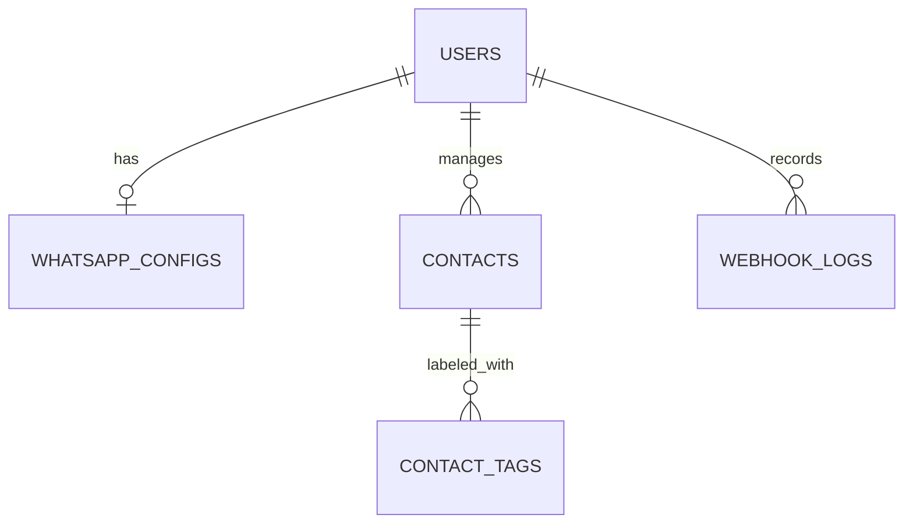

# 🚀 NotifyNow | Developer Onboarding & Handover Report

This document serves as the complete technical handover report for **NotifyNow** (Multi-Channel Notification Platform). It is designed to help incoming developers quickly understand the backend flow, system architecture, database schemas, local setup, and deploy procedures.

---

## 📋 1. Project Overview & Business Logic
**NotifyNow** is an enterprise-grade multi-channel notification engine (SMS, WhatsApp, RCS, Email, and Voicebot) designed for marketing campaign dispatch, transactional alert routing, and interactive chat automation.

### Key Logic & Workflows:
1. **Multi-Tenancy**: Isolated database structure using strict `user_id` filters in SQL.
2. **Role-Based Access Control (RBAC)**:
   * **Admin (Super-Admin)**: Controls gateways, wallet recharge, plans, default templates, system logs, and reseller margins.
   * **Reseller**: Operates a sub-tenant business. Can create client accounts, assign credits, set custom pricing for channels, and view consolidated usage reports.
   * **Client**: Runs campaigns, uploads CSV contacts, maps variables, customizes SMS/RCS/WA/Email templates, interacts via Live Support Chat, and accesses detailed delivery logs.
3. **Wallet & Billing Ledger**: Every campaign recipient deducts credits atomically from the user's wallet. If the wallet balance reaches zero during sending, campaigns are paused automatically to avoid debt. Billing calculations factor in SMS unicode parts, WhatsApp Meta categories, and voice call durations.

---

## 🛠️ 2. Technical Stack
The system is built on a high-throughput **MEN** stack (MySQL, Express, Node.js) with a **React** frontend.

* **Frontend**:
  * React (Vite + TypeScript) SPA
  * Styling: Tailwind CSS (fully responsive, mobile-first layouts)
  * Icons: Lucide React
  * Routing: React Router DOM
* **Backend**:
  * Node.js & Express.js REST API
  * Databases:
    * **MySQL / MariaDB** (Primary relational storage for users, configs, campaigns, logs, and wallet)
    * **Redis** (In-memory storage for BullMQ queue state & rate-limiting)
  * Websockets: Socket.io for live chat syncing.
* **Campaign Processing Engine**:
  * **BullMQ (Redis-based)**: High-scale message ingestion queue capable of executing millions of sends.
  * **Classic SQL Worker (`queueService.js`)**: Runs a backup polling loop (every 15 seconds) to process messages directly via SQL if Redis is offline or during local development.
* **Integrations**:
  * **RCS**: Dotgo API
  * **WhatsApp (Official)**: Meta Cloud API via Pinbot gateway (`partnersv1.pinbot.ai`)
  * **WhatsApp (Unofficial)**: Custom WhatsApp Web API gateway via Proero (`wa.notifynow.in`) with QR session pairing
  * **SMS**: Custom HTTP gateways (compatible with Kannel SMS gateway structures)
  * **Email**: SMTP integration via Nodemailer
  * **Voicebot**: TTS (Text-to-Speech) / static audio API gateways
  * **Payment Gateway**: CCAvenue Secure Gateway

---

## 📊 3. Database Blueprint & Core Schemas

Here are the schemas of the core tables that handle multi-tenant users, contact tags, and messaging histories.



### A. Users Table (`users`)
Stores the profile, authentication, wallet balance, active gateway limits, and reseller hierarchy.
* `id` (INT, Primary Key, Auto Increment): Unique user ID (Client, Reseller, or Admin).
* `name` / `email` / `password`: Standard profile credentials.
* `role`: Enum (`'user'`, `'admin'`, `'reseller'`).
* `wallet_balance` (DECIMAL): Remaining currency in Rupees.
* `whatsapp_config_id` (INT): Foreign key linking to active official WhatsApp configuration.
* `rcs_config_id` (INT): Foreign key linking to active RCS configurations.
* `rcs_text_price` / `rcs_rich_card_price` / `rcs_carousel_price`: Customized pricing overrides.

### B. WhatsApp Configs Table (`whatsapp_configs`)
Stores official Meta API business details.
* `id` (INT, Primary Key, Auto Increment)
* `chatbot_name` (VARCHAR): Display name of the active chatbot.
* `domain` (VARCHAR): Dedicated domain link (e.g. `naafie.com`).
* `customer_id` (VARCHAR): Registered customer profile ID.
* `wa_token` (TEXT): Meta API permanent bearer token.
* `ph_no_id` (VARCHAR): Meta Phone Number ID.
* `wa_biz_accnt_id` (VARCHAR): Meta WhatsApp Business Account (WABA) ID.

### C. Contacts Table (`contacts`)
* `id` (VARCHAR, Primary Key)
* `user_id` (INT): Owner of this contact.
* `name` (VARCHAR)
* `phone` (VARCHAR): Phone number in clean format (E.164, without '+' or spaces).
* `assigned_agent` (VARCHAR): Email of the assigned support user.
* `auto_reply` (TINYINT): Toggle (`1` = active chatbot, `0` = paused / manual takeover).

### D. Webhook Logs Table (`webhook_logs`)
Main log table storing all incoming/outgoing messages. This is the source for chats history.
* `id` (INT, Primary Key, Auto Increment)
* `user_id` (INT)
* `sender` (VARCHAR): Sender's phone number or `'System'` if outgoing.
* `recipient` (VARCHAR): Recipient's phone number or `'chatbot'`/`'System'` if incoming.
* `message_content` (TEXT): Text content of the message.
* `media_url` (VARCHAR): Relative server file path for image/pdf attachments.
* `status` (VARCHAR): `'sent'`, `'delivered'`, `'received'`, or `'failed'`.
* `type` (VARCHAR): Communication channel (`'whatsapp'`, `'rcs'`, `'sms'`).

---

## 🚀 4. End-to-End Chat & Messaging Flow

```
[Frontend UI] --(POST /send)--> [Express Router] --(API Call)--> [Meta/RCS Gateway]
      ^                                                                 |
      | (Socket.io Update)                                              v
[Socket Server] <--------(Trigger Webhook)---------------------- [Meta/RCS Webhook]
```

### Outgoing Message Flow
1. **Trigger**: User types a reply on the **Chats Page** and hits send.
2. **API Call**: Frontend calls `POST /api/chats/send` with `{ recipient, message, channel }`.
3. **Dispatch**:
   - If WhatsApp, queries the user's config and triggers Meta API.
   - If RCS, routes payload via Dotgo API.
4. **Logging**: Saves the outgoing message to the database table `webhook_logs` with `sender = 'System'`, `recipient = cleanPhone`, and `status = 'sent'`.
5. **Real-time Sync**: Server triggers `req.io.to('user_userId').emit('new_message')` to update the active chat screen on other open tabs.

### Incoming Webhook & Chatbot Flow
1. **Trigger**: Customer responds on WhatsApp/RCS.
2. **Endpoint**: Meta/Dotgo servers send a POST callback to `/api/webhooks/whatsapp` or `/api/webhooks/rcs`.
3. **Logging**: Backend parses the incoming payload, matches the phone number with the appropriate `user_id`, and logs the message into `webhook_logs` with `sender = customer_phone`, `recipient = 'System'`, and `status = 'received'`.
4. **WebSocket Sync**: Emits `new_message` to the socket room of the user so the chat list updates immediately.
5. **Chatbot Reply**:
   - Check if the contact has `auto_reply = 1` in the `contacts` table.
   - If enabled, parses matched keywords in `chat_flows` table.
   - If a matching node flow matches the keyword, compiles the response message and triggers a reply back to the customer.

---

## 💻 5. Local Database Setup & Initialization Guide

To recreate the development database environment from scratch on your local machine, execute the following steps:

### Step 1: Create Database
Make sure MySQL (or XAMPP) is running. Log in to MySQL client and drop/create the database:
```sql
DROP DATABASE IF EXISTS notifynow_db;
CREATE DATABASE notifynow_db;
```

### Step 2: Configure Environment File
Configure database credentials in your local `.env` located in the `/backend` directory:
```env
DB_HOST=localhost
DB_USER=root
DB_PASS=
DB_NAME=notifynow_db
```

### Step 3: Run Database Creation and Seed Scripts
Run the following scripts sequentially from the **project root directory** to build all schemas and seed test data:
```bash
# 1. Setup users, resellers tables and seed sandeep@gmail.com (admin)
$env:NODE_PATH="backend/node_modules"; node backend/scripts/setup_users_resellers.js

# 2. Run schema updater (Tickets, Webhook Logs, campaigns etc.)
$env:NODE_ENV="development"; $env:NODE_PATH="backend/node_modules"; node backend/apply_schema_updates.js

# 3. Initialize WhatsApp configs table
$env:NODE_PATH="backend/node_modules"; node backend/scripts/create_whatsapp_configs_table.js

# 4. Initialize Contacts table
$env:NODE_PATH="backend/node_modules"; node backend/scripts/fix_contacts_table.js

# 5. Initialize RCS bot tables
$env:NODE_PATH="backend/node_modules"; node backend/scripts/init-database.js

# 6. Seed dummy chats data (creates demo conversations, logs, and tags for local testing)
$env:NODE_PATH="backend/node_modules"; node backend/scripts/seed_dummy_chats.js
```

### Step 4: Access Local Account
Start the backend (`npm run dev` in `/backend`) and frontend (`npm run dev` in `/frontend`), and log in to the dashboard:
* **Email**: `sandeep@gmail.com`
* **Password**: `password123`

---

## ⚠️ 6. Key Coding Standards & SQL Warnings

When modifying SQL queries or adding joins, incoming developers MUST strictly adhere to the following rules:

### Rule 1: Always Qualify Ambiguous Columns in Joins
When joining tables like `users` (which has a `contact_phone` column) with subqueries from `webhook_logs` (which also evaluates a `contact_phone` column), always prefix the select statement with `table_alias.column` (e.g. `t.contact_phone`). Failure to do so will result in an `ER_NON_UNIQ_ERROR` (Column is ambiguous) and crash the chats listing API.

### Rule 2: Explicitly Resolve Collation Mismatches
The database uses different collations for specific columns. For instance, the `contacts` table uses `utf8mb4_unicode_ci` while `webhook_logs` uses `utf8mb4_general_ci`. When joining these tables, you must append `COLLATE utf8mb4_unicode_ci` on string comparisons:
```sql
LEFT JOIN contacts c ON c.phone = t.contact_phone COLLATE utf8mb4_unicode_ci
```
Without this clause, joins will fail with the error: `Illegal mix of collations (utf8mb4_unicode_ci,IMPLICIT) and (utf8mb4_general_ci,IMPLICIT) for operation '='`.

### Rule 3: Do Not Use GROUP BY for Chronological Status/Content
Never use `GROUP BY contact_phone` with aggregate functions like `MAX(message_content)` or `MAX(status)` to find the latest chat preview. MySQL treats `MAX()` alphabetically (e.g. "Yes" is evaluated as higher than "Hello"), resulting in out-of-order chat previews.
* **Standard Solution**: Always partition records using `ROW_NUMBER() OVER (PARTITION BY contact_phone ORDER BY created_at DESC)` and select rows where the row number is `1`.

---

## 🛠️ 7. Production Deployment

The production environment is managed using **PM2** on the live server.
To apply changes, SSH into the production server, navigate to the deployment folder, and execute:
```bash
./deploy_production.sh
```
This zero-downtime deployment script will automatically execute git pulls, production builds for React frontend, trigger node packages updates, run migration patches (`apply_schema_updates.js`), and hot reload the PM2 cluster instance (`notifynow-live-prod`).
